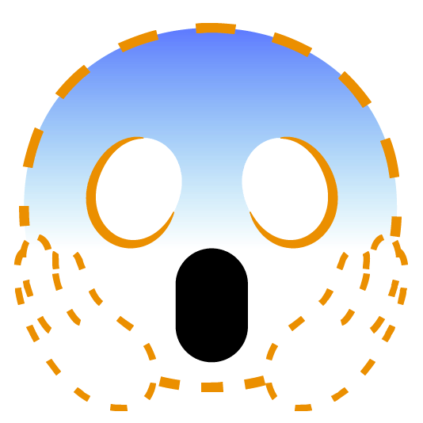

# CPE334Project
For subject CPE334, KMUTT

# Project Idea
- Daily Life Management Android Application

### Daily Life Management as a Student
- Pin notes and due dates, can add stages with tags
- Group notifications
- To buy list + To Do List 
- Map Links for meet ups
- Schedule

### Random Idea (Probably won't be added)
- NFC tap to friend for sending in app stuff
- Group chat messaging system
- Map location with GPS tracking

# Progress update

### 3 Nov Meeting

Update Codebase

- Main connecting page
    - @EXer07 and @Sirapobchon
    - Use main.py to connect to homepage, login, signup, todo, tobuy, and calendar

- @everyone Whoever is free, start making a report
    - Report Requirement
    - Abstract
    - Problem Definition
        - Functional Requirement - Done
        - Use-case Diagram
        - Use-case Narrative
    - Architectural Design
        1. Tools
            - Diagram Drawing Tools
                - Visual-Paradigm
            - Source Control Management
                - Gitub
            - UI Design Tools
                - Canvas
            - IDE
                - VS Code with extension
            - Compile
                - Andriod Studio
        2. Computing Languages
            - Python
                - Flet UI
            - Google Firebase
                - Firebase Backend
        3. Component and User Interface
    - Other Design Elements
        1. Activites Diagram
        2. Sequence Diagram
        3. Package Diagram
        4. Database Diagram
    - Development Process
    - Self-Evaluation
    - Appendix

- Backend table by @Sirapobchon and @pppcyd
    - Authticate (User sign-in) - 2/2 Done
    - ToDo Data - 0/1
    - ToBuy Data - 0/1
    - Calendar - 0/2
    - Data Connection - 0/2
    - Total 2/8

- Scrum process
    - @EXer07 Notification - 3
    - @janekmutt Forget Password Page - 1
    - @EXer07 and @Sirapobchon Firebase Server - 8 remain 6
    - @WangSonicS Calendar that can hold reminders - 8

### 1 Nov Backend Meeting

Deciding the Back-end future

### Change to Google Firebase instead of django
- Reason:
    - easier
    - cloud hosting (No need for open own server)

- Scrum process
    - @EXer07 Notification - 3
    - @janekmutt Forget Password Page - 1
    - @EXer07 and @Sirapobchon Firebase Server - 8

### 26 Oct 2ND Sprint Start Meeting

Sprint Start Meeting

- Scrum process
    -  Sprints
        - 26 Oct - 9 Nov
            - Scoring and Scrum Planning
            - @pppcyd To Buy-list - 3
            - @janekmutt Value Calculator - 2
            - @janekmutt Home page continue - 1
            - @WangSonicS Calendar that can hold reminders - 8
            - @EXer07 and @Sirapobchon backend stuff for all page - alot
            - @everyone Whoever is free, start making a report
        - 9 Nov - 22 Nov
        - 22 Nov - 28 Nov
    
- The work should be completed more than 80% because if not it will not be completed in time.

### 19 Oct Sprint End Meeting

Sprint End Meeting

- Scrum process
    -  Sprints
        - 6 Oct - 19 Oct
            - Login and Signup Page @EXer07 
                - Score 3 remaining 2 point
                - Need Link Page and Backend @Sirapobchon
            - To-Do List @pppcyd
                - Score 2 remaining 1 point
                - Remaining Backend @Sirapobchon
            - Home page @janekmutt
                - Score 2 remaining 1 point
                - Icon instead of picture
            - Connecting Page
                - Come from Home Page of Jane
                - Waiting for Jane to be done with Home page
                - Scoring up to 8
        - 26 Oct - 2 Nov
        - 3 Nov - 15 Nov
        - 17 Nov - 28 Nov
    - Requirement Calculation score
        - Home page - 3
            - Connecting Page (Continuation from Home Page)
        - Login and Signup Page - 5
        - To-Do List and To-Buy List - 3
        - Price and Value Calculation - 2
        - Calendar - 8
        - Notification - 5
    - Next sprint planning
        - Starting 26 Oct due to Midterm test

### 11 Oct Emergency Meeting

The big OH... moment

@Sirapobchon had discovered that flet(UI) could only be run as one file. 

No dividing into multiple .py files to run. 
Only import to be page run in the main.py file.
Meeting for letting everyone know that the files format will probably needed to be changes. 

- Need fixing
    - login.py
    - main.py
    - django
        - settings.py
        - urls.py
        - user app
            - models.py
            - views.py

### 5 Oct planned meeting

Thursday 5 Oct Meeting planning

- Main Function to be done
    - To do list 
    - To buy list 
        - Total price calculation
    - Notification
    - Calendar
        - With note 
    - Login and Signup page 
    - Price Budget Calculate
        - New idea

- New Functional Requirements:
    - Login and Signup Page:
        - Users should be able to create an account with a username and password.
        - Existing users should be able to log in securely.
        - There should be password recovery options (e.g., email verification, security questions).
        - User authentication should be secure and protect user data.
    - To-Do List and To-Buy List:
        - Users should be able to create, edit, and delete tasks.
        - Each task should have a title, description, due date, and priority.
        - Tasks should be organized by categories or projects.
        - Users should be able to mark tasks as completed.
        - There should be a way to filter and sort tasks (e.g., by due date or priority).
        - Users should receive notifications or reminders for upcoming tasks.
        - Users should be able to create a shopping list.
        - Each item on the list should have a name, quantity, and optional notes.
        - Users should be able to mark items as purchased or delete them.
        - There should be a way to categorize items (e.g., groceries, household items).
    - Price and Value Calculation:
        - Users should be able to input prices and quantities of items.
        - The application should calculate the total cost and provide a breakdown.
        - Users should be able to calculate the value of items (e.g., investments, assets).
        - There should be support for different currencies or units of measurement.
    - Calendar:
        - Users should be able to add events/appointments to the calendar.
        - Each event should have a title, date, time, location, and notes.
        - Users should be able to view their calendar by day, week, or month.
        - Calendar should support recurring events (e.g., weekly meetings).
        - Users should have the option to set reminders for calendar events.
    - Notification:
        - Users should receive notifications for various events (e.g., task deadlines, calendar events).
        - Notifications should support multiple platforms (e.g., mobile notifications, email notifications).
        - Users should have the option to customize notification preferences (e.g., sound, vibration).

- Scrum process
    - @pppcyd Scrum Master
    - 2 Week of Sprint Length
    - 4 Sprints
        - 6 Oct - 19 Oct
            - Login and Signup Page @EXer07
            - To-Do List and To-Buy List @pppcyd
            - Home page @janekmutt
        - 20 Oct - 2 Nov
        - 3 Nov - 15 Nov
        - 17 Nov - 28 Nov
    - Requirement Calculation score
         - Login and Signup Page - 5
         - To-Do List and To-Buy List - 3
         - Price and Value Calculation - 2
         - Calendar - 8
         - Notification - 5

- Theme template deciding
    - Font theme
        - SF Pro https://developer.apple.com/fonts/
    - Color theme
        - 
        - #86E3CE
        - #D6E6A5
        - #FFDD94
        - #FA897B
        - #CCABD8

### 25 Sep First Draft

Functional Requirements

Functional Requirements:

- User Registration and Profile:
    - Users can create accounts and log in.
    - Users can update their profiles.
- Dashboard:
    - Users see a home screen showing notes, due dates and notifications.
- Notes and Tasks:
    - Users can create, edit, and delete notes.
    - Tasks can be organised with stages and tags.
    - Tasks have priorities and deadlines.
    - There's a to-do list for tasks.
- Groups and Notifications:
    - Users can create and join groups.
    - Groups support announcements and notifications.
- Shopping List:
    - Users can create shopping lists.
    - Easy item management and reminders.
- Map Integration:
    - Users can share map links.
- Schedule and Calendar:
    - Users have a calendar for events.
    - Events support reminders.
- Settings and Security:
    - Users can customise app settings.
    - Ensure data security and privacy.
- Offline Mode:
    - App works offline with basic features.
- Data Backup and Sync:
    - Users can back up and sync data.
- Feedback and Support:
    - Users can provide feedback.
    - Include a help section.
- Documentation:
    - Provide a user manual.

### 24 Sep Meeting

Project Planning

- Project name
    - *INSERT COOL CATCHY NAME HERE*
    - LifeHack (Backup Name)
- Appication
    - Android compile
        - https://youtu.be/NA2R7zagNzM?si=B_tl8xjbMyA8Ls27
    - Flutter(Flet) (UI) - @Sirapobchon,@pppcyd,@janekmutt,@EXer07
        - Python Language
        - https://www.codesass.com/blog/articles/flet      
    - Django (Backend) - @Sirapobchon,@EXer07,@WangSonicS
        - https://devhub.in.th/blog/django-python
- UI Designing (Flet)
    - Notification
        - https://youtu.be/dhQ-zPErVgQ?si=KPA64J1p7gnu7JXC
    - To Do List
        - https://youtu.be/qRqxAUC_4oA?si=GD1teHgYMIzd__Xe
    - Learning Playlist
        - https://youtube.com/playlist?list=PLIYV27zh-hBEcu70pkUkdbwrJuKqdQ9tK&si=RCJESJDf4saLO4rm
- Github Progress update
    - Only me probably
    - For version keeping
    - Because "Coding"

### 11-12 Sep Consultation

Project approval

- Daily Life Management as a Student Project approval

